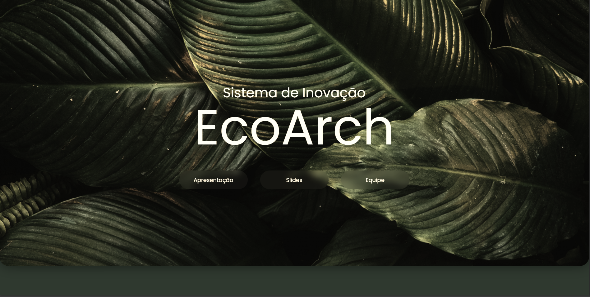

# EcoArch - Tecnologia, Inovação e Sustentabilidade

Bem-vindo ao repositório do **EcoArch**, um projeto desenvolvido para uma apresentação que destaca as características sustentáveis da empresa, com foco em **Conforto Inteligente** e **Edifícios Sustentáveis**. Este projeto foi criado entre outubro e novembro de 2024 e consiste em uma landing page moderna e interativa, dividida em três páginas principais.

## 🚀 Visão Geral

O **EcoArch** é uma empresa fictícia de tecnologia e inovação que busca integrar sustentabilidade, conforto e eficiência em suas soluções. Este projeto foi desenvolvido como uma landing page de apresentação, com o objetivo de mostrar como a tecnologia pode ser aliada à sustentabilidade para criar ambientes inteligentes e ecologicamente responsáveis.

### Características Destacadas:

- **Conforto Inteligente**: Soluções tecnológicas que promovem bem-estar e eficiência energética.
- **Edifícios Sustentáveis**: Projetos arquitetônicos que priorizam o uso de materiais ecológicos e a redução de impactos ambientais.

## ✨ Funcionalidades

- **Design Moderno e Responsivo**: Páginas adaptáveis a diferentes dispositivos (desktop, tablet, mobile).
- **Navegação Intuitiva**: Links entre as páginas para uma experiência fluida.
- **Conteúdo Interativo**: Uso de imagens, vídeos e textos para engajar o usuário.
- **Foco em Sustentabilidade**: Destaque para as práticas e tecnologias sustentáveis da EcoArch.

## 🛠️ Tecnologias Utilizadas

- **HTML5**: Estruturação do conteúdo das páginas.
- **CSS3**: Estilização e design responsivo.
- **JavaScript**: Interatividade e dinamismo.
- **Imagens e Vídeos**: Para ilustrar as características sustentáveis da empresa.

## 📁 Estrutura do Projeto

```
/EcoArch-Main
│
├── /css
│   └── /img
│
├── /pages
│   ├── /Page1
│   │   ├── /CSS
│   │   │   ├── styles.css
│   │   │   ├── /Img
│   │   │   └── /Video
│   │   ├── index.html
│   │   └── script.js
│   │
│   └── /Page2
│       ├── /css
│       │   ├── styles.css
│       │   ├── /img
│       │   └── /video
│       ├── index.html
│       └── script.js
│
├── index.html
├── script.js
└── README.md
```

### Páginas do Projeto:

1. **Página Principal (`index.html`)**: Apresentação geral da EcoArch, com links para as páginas de **Conforto Inteligente** e **Edifícios Sustentáveis**.
2. **Página 1 (`Page1/index.html`)**: Destaque para as soluções de **Conforto Inteligente**, com imagens, vídeos e textos explicativos.
3. **Página 2 (`Page2/index.html`)**: Foco em **Edifícios Sustentáveis**, mostrando projetos e tecnologias que reduzem o impacto ambiental.

## 🌐 Como Visualizar

Você pode acessar o projeto online através do link de deploy:  
🔗 **[Acessar Deploy](https://ecoarch.netlify.app/)**

Ou, se preferir, clone o repositório e abra o arquivo `index.html` no seu navegador:

```bash
git clone https://github.com/seu-usuario/EcoArch-Main.git
cd EcoArch-Main
```

Ou acesse o link do deploy (se disponível).

## 🎯 Objetivos do Projeto

- **Apresentação Visual**: Criar uma landing page atraente e informativa para destacar as características sustentáveis da EcoArch.
- **Conscientização**: Mostrar como a tecnologia pode ser usada para promover sustentabilidade e conforto.
- **Experiência do Usuário**: Proporcionar uma navegação fluida e interativa.

---



---

Feito com 💜 por [Leonardo Leal](https://github.com/LeonardoNXT)
